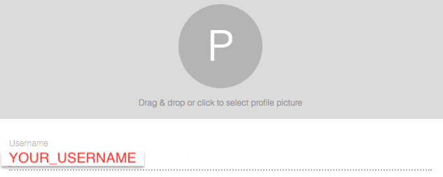
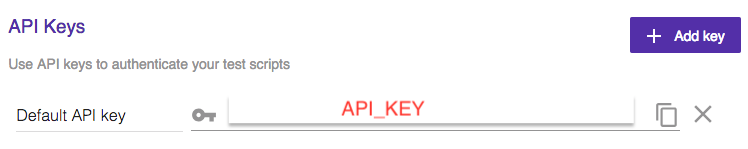
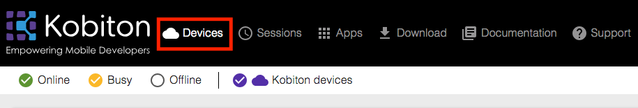
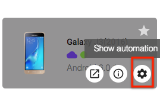
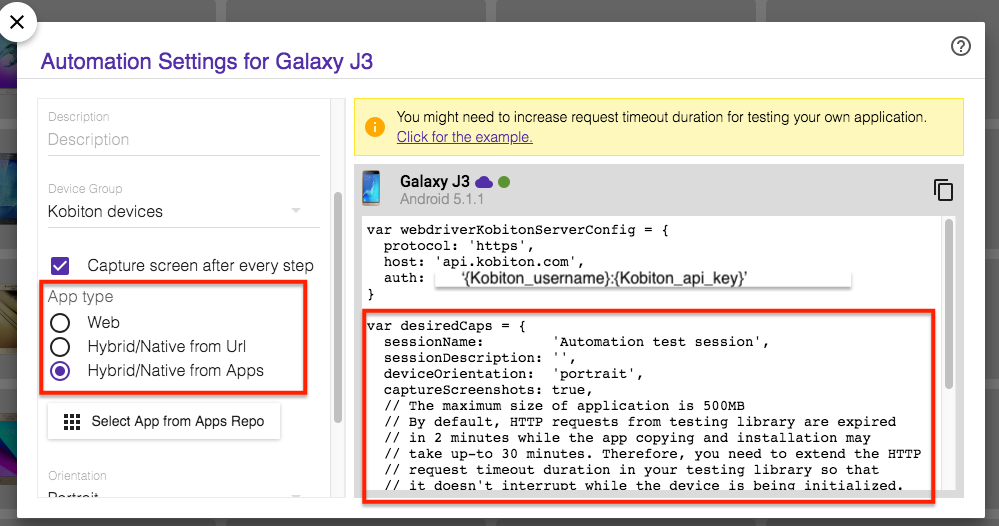
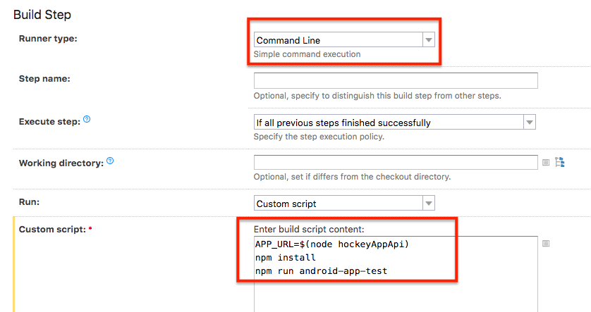
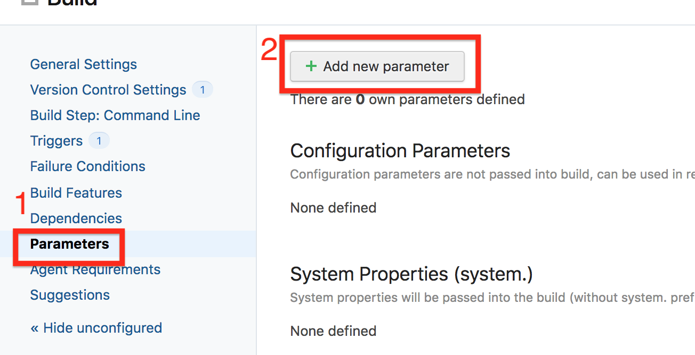
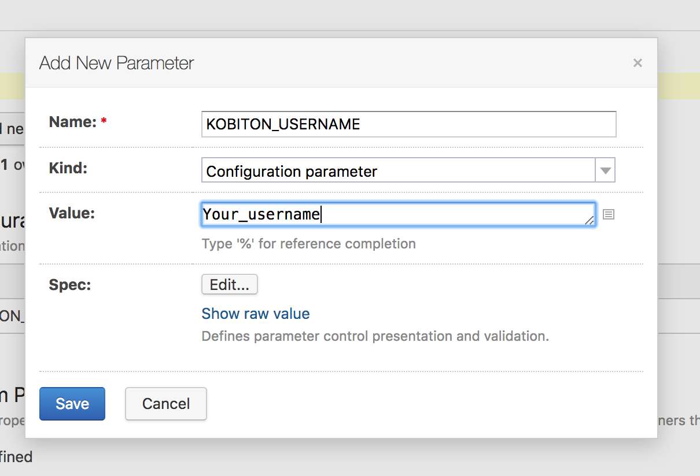
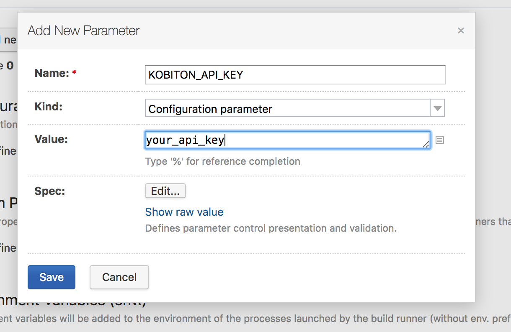
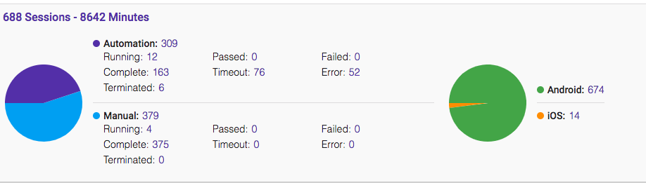

# Running Automation test with Kobiton
This guide will demonstrate how to run the automation test on Kobiton devices with TeamCity through GitHub repository.
## Table of contents
+ [Prerequisites](#prerequisites)
+ [1. Config TeamCity and integrate with GitHub](#1-config-teamcity-and-integrate-with-github)
+ [2. Config automation test script](#2-config-automation-test-script)
+ [3. Run automation test on Kobiton devices](#3-run-automation-test-on-kobiton-devices)
+ [4. Fetch test session data through Kobiton REST API](#4-fetch-test-session-data-through-kobiton-rest-api)
## Prerequisites 
- Java(JRE). Supported are:
  + Oracle java 8 or higher
  + OpenJDK 8
- Kobiton account
## 1. Config TeamCity and integrate with GitHub
This part will guide you how to setup TeamCity and configure TeamCity with GitHub. Skip step if you already have TeamCity setup.
 + For the introduction on how to install and configure the TeamCity server, follow [this guide](https://confluence.jetbrains.com/display/TCD18/Installing+and+Configuring+the+TeamCity+Server).

Set up your project and link your app repository that we will test with Kobiton later.
+ Connect GitHub with TeamCity, you can follow [this guide](https://confluence.jetbrains.com/display/TCD10/Integrating+TeamCity+with+VCS+Hosting+Services).
 
  > For more information about TeamCity can be found in [this tutorial](https://confluence.jetbrains.com/display/TCD10/TeamCity+Documentation).

## 2. Config automation test script
This documentation will use NodeJS as the default language to demonstrate the guide. 
> Kobiton already provide samples for automation test script on multiple languages. Visit [here](https://github.com/kobiton/samples) for references.
### 2.1 Get Username and API key
Go to https://portal.kobiton.com.
- Username
  + Select *user Icon* -> 'Profile' (you might find it in the top right conner)

  

- API key 
  + Select *user Icon* -> 'Settings' (you might find it in the top right conner)

  

### 2.2 Get desired capabilities
The desired capabilities need to be added to the automation test script in order tests to be executed on the Kobiton device.
  + Click *Devices* in the top navigation bar.
 
    
 
  + Hover over any device that you want to test with and click on the Automation settings button. A dialog box will then appear on screen.
 
    
 
  + On the left hand side, you can select your preferred language, App Type, etc.
     > For this the sample, we use `NodeJS` as the language to run automation test. 

     
### 2.3 Config TeamCity project
Follow step below to setup TeamCity for automation testing
+ In your Teamcity project, on the left side on the page, click on 'Build Step' to set build steps.
+ On the right side of the page,  for the 'Runner type' category, choose 'Command Line '.
+ Add below command to `Custom script` part.

```
  cd javascript
  npm install
  npm run android-web-test
```
> Note:
> + `cd javascript` is the command if you using NodeJS
> + `npm install` is the command to install missing dependencies
> + `npm run android-app-test` is the command to run the test script



**(Optional) Attaching environment variable to Teamcity**
+ In your project in TeamCity, on the left side of the page, click on 'Parameters'. Then click the `Add new parameter` button. 



+ Add your Kobiton username and API key.




### 2.4 Config automatuon test script
Kobiton already provides sample for automation test, visit [here](https://github.com/kobiton/samples) for reference.

In the script, replace `username`, `apiKey` values with your Kobiton's username, API key  and `desiredCaps` with the one collected from above part.

Example:

```
const username = {kobiton_username}
const apiKey = {kobiton_api_key}
 const kobitonServerConfig = {
  protocol: 'https',
  host: 'api-test.kobiton.com',
  auth: `${username}:${apiKey}`
}
 var desiredCaps = {
  sessionName:        'Automation test session',
  sessionDescription: '', 
  deviceOrientation:  'portrait',  
  noReset:            true,
  fullReset:          false, 
  captureScreenshots: true,
  app:                {your_app_id}, 
  udid:               {your_device_udid}
}
```
## 3. Run automation test on Kobiton devices
+ Push your changes to GitHub. TeamCity  will install the neccessary dependencies and then run the test on Kobiton. 


+ Once the test is complete, you can login to Kobiton and see the result in https://portal.kobiton.con/sessions



## 4. Fetch test session data through Kobiton REST API

+ Kobiton already provides a Node.js sample on how to get session information, get session commands using Kobiton REST API. 
+ Go to https://github.com/kobiton/samples/rest-api and follow the instruction.
-------
You can now run automation tests with Kobiton from TeamCity!