# Triggering a Teamcity build from a push GitHub

This guide will demonstrate how to get Teamcity to build your project every time your source code is changed and pushed to GitHub.
## Prerequisites
+ Java(JRE). Supported are:
    + Oracle java 8 and updates
    + OpenJDK 8
+ Download and install TeamCity
+ TeamCity account
+ GitHub repository
## 1.1. Sign in to Teamcity 
+ You can download and install TeamCity from [here](https://confluence.jetbrains.com/display/TCD10/Installation+Quick+Start).  

+ Start TeamCity server, enter your TeamCity username and password, then click `Log in`.

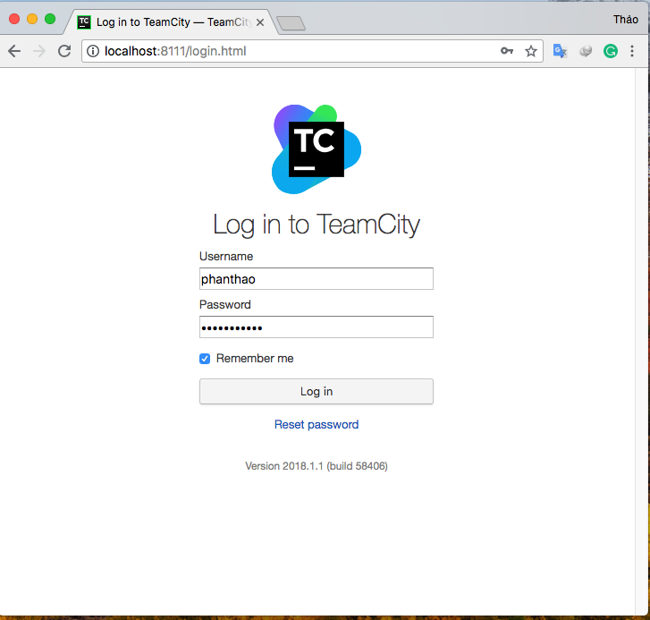
## 1.2 Connect TeamCity with GitHub
+ Now you need to create a project, to do this click on `Projects` and then `Create Project`. 

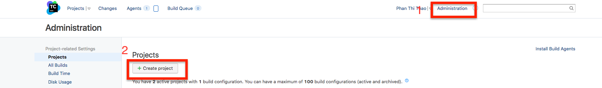

+ You then get the options of which of source control repository you are linking to, I'm going to select "From GitHub".

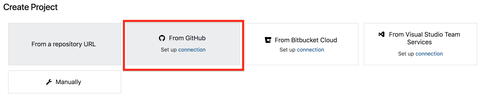

+ The dialog will appear, click `Register TeamCity` to set up OAuth authentication with GitHub.  

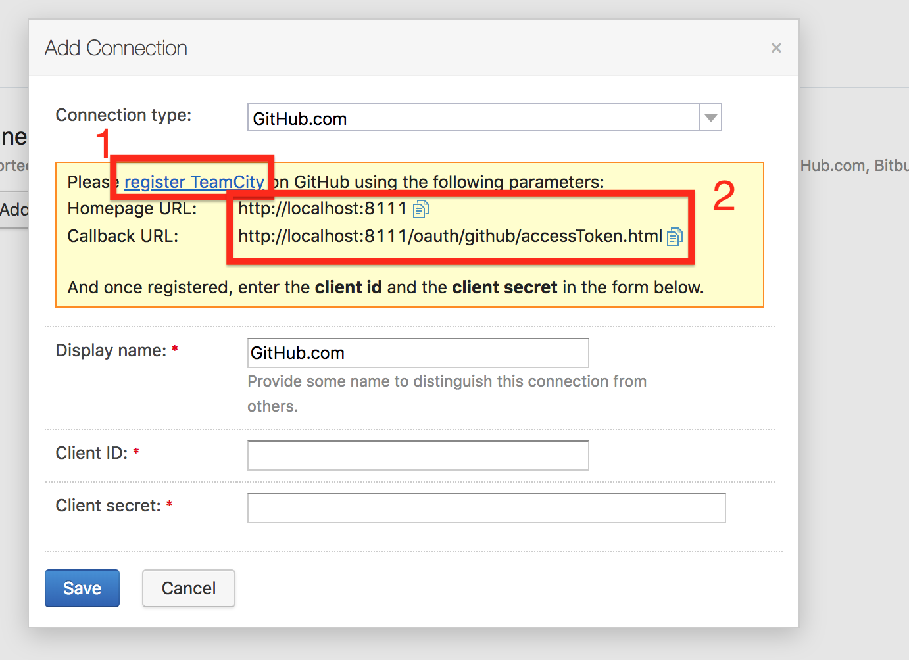

+ You will be redirected to GitHub. Enter the 'application name', 'homepage URL' and 'authorization callback URL' and click `Register application`.
>Note:
    >+ Copy "Homepage URL" and "authorization callback URL" in the "Add Connection" dialog. 

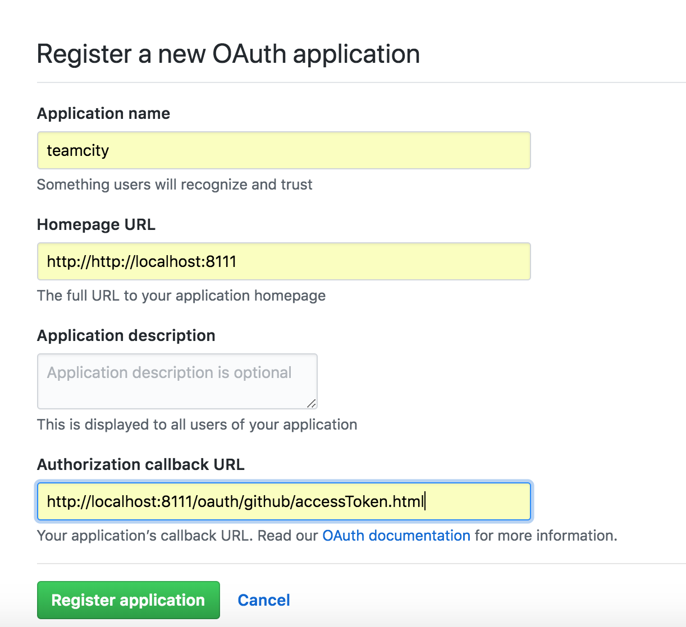

+ A page with "Client ID" and "Client Secret" will open. Copy and paste them to TeamCity and click `Save`. 

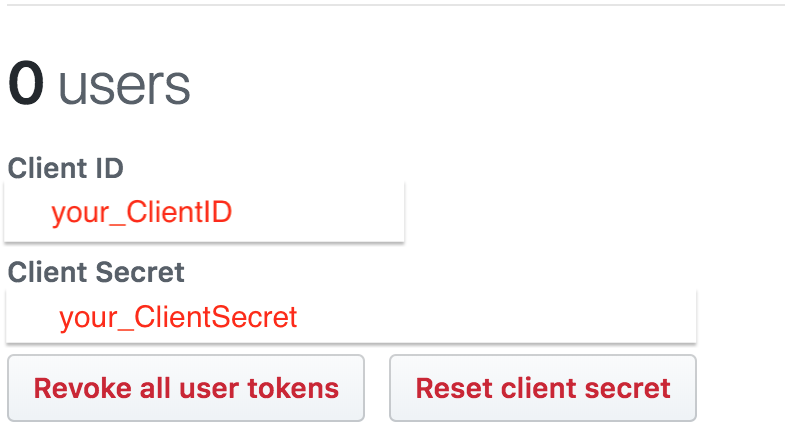

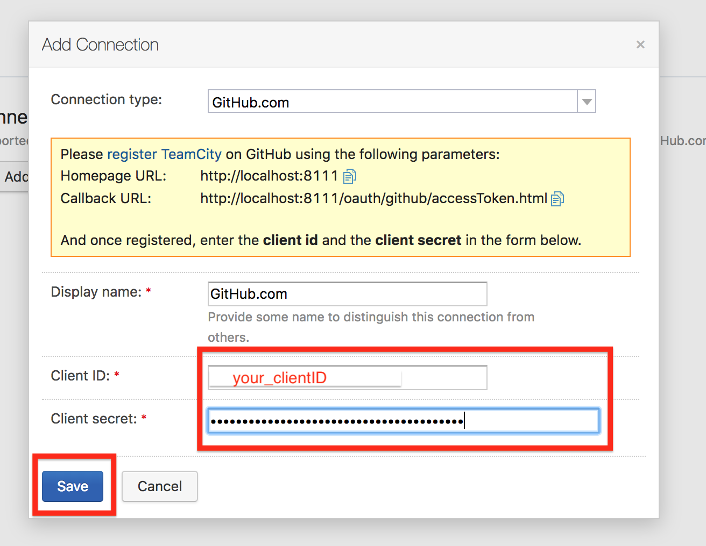
## 1.3 Create a project
+ Click `Sign in to GitHub`. 

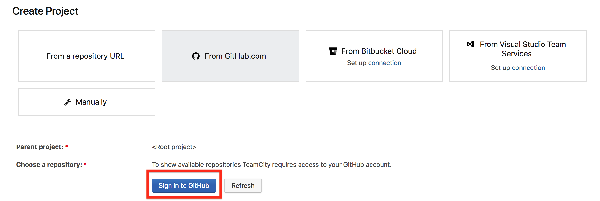

+ The connection set up, you can choose a GitHub reposity from list.

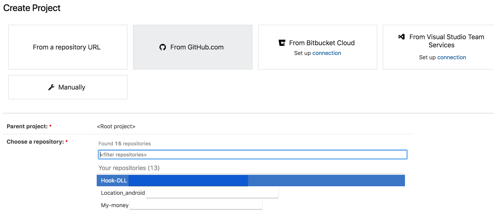

+ Click `Proceed` to creat project from GitHub reposity.

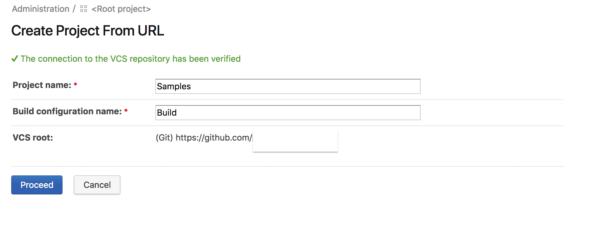

+ Now, when you push to GitHub, you can see the TeamCity auto build. 

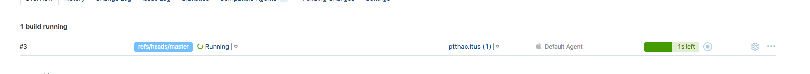