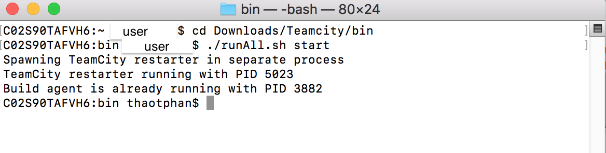
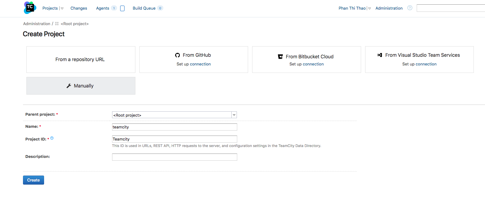
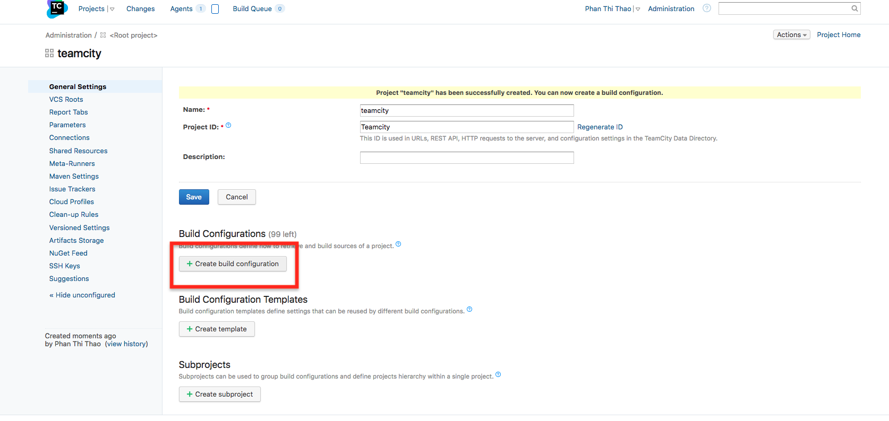
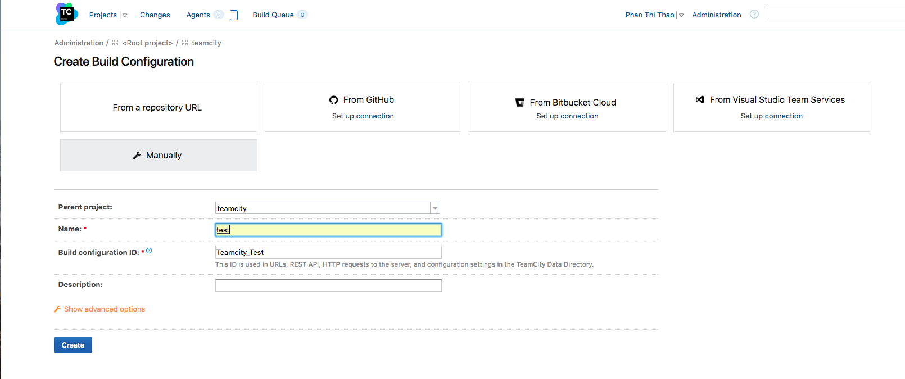
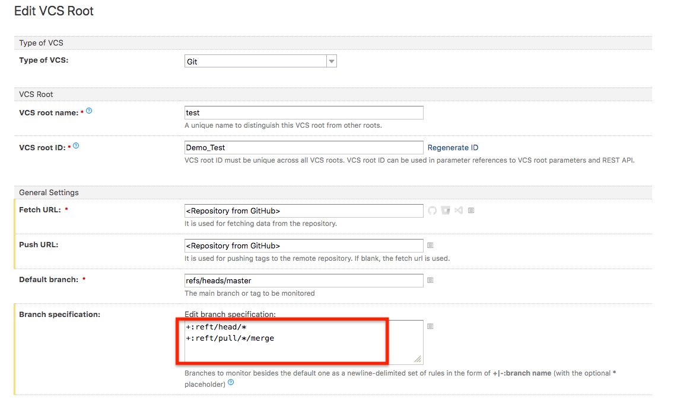
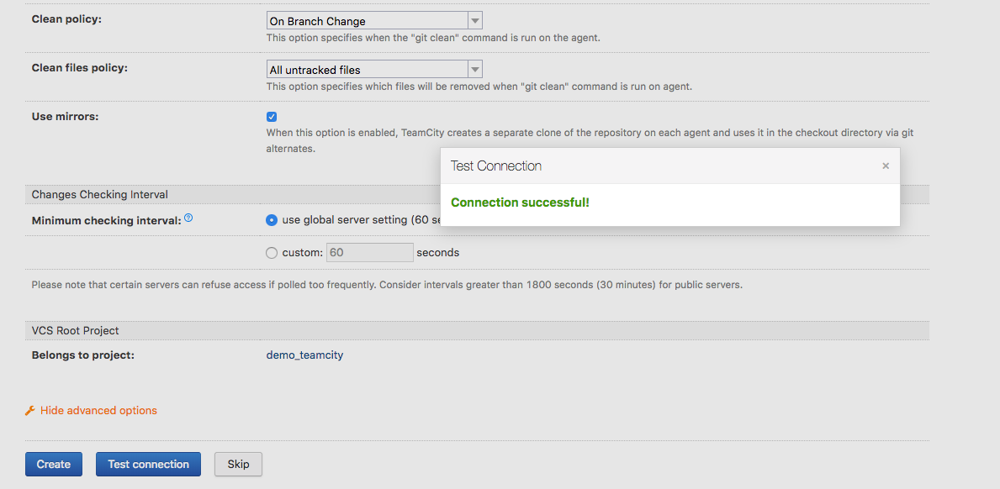
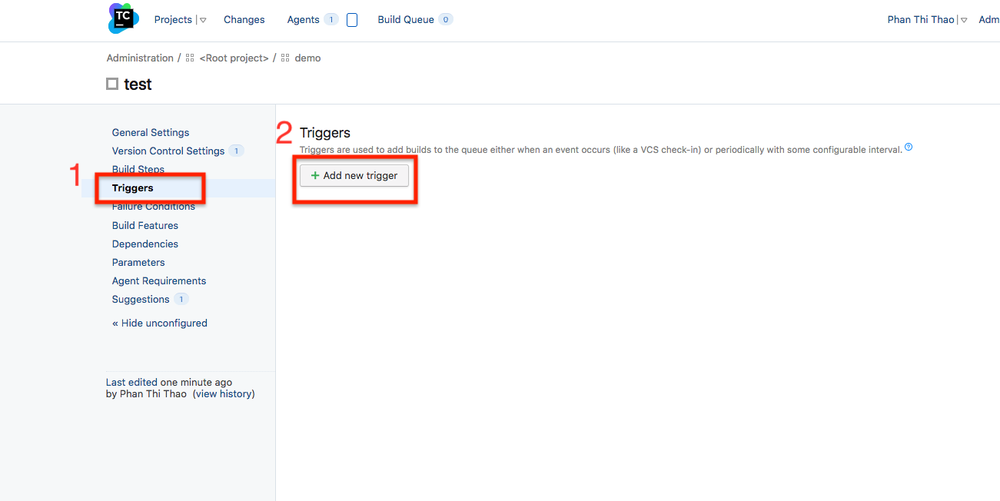
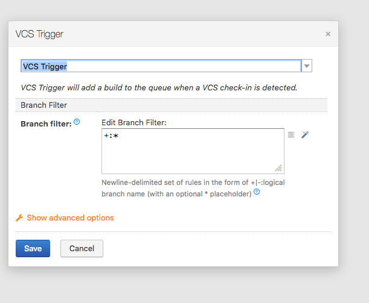

# Triggering a Teamcity buid from a push GitHub

This guide will demonstrate how to get Teamcity to build your project everytime your soure code is changed and pushed to GitHub
## Prerequistes
+ Java(JRE). Supported are:
    + Oracle java 8 and updates
    + OpenJDK 8.
+ Download and install TeamCity in https://www.jetbrains.com/teamcity/download/
+ TeamCity account
+ GitHub repository
## 1. Sign in to Teamcity 
+ Starting TeamCity server by running the following in your terminal:
    ```
     cd TeamCity/bin
     ./runAll.sh start
    ```
By default, TeamCity run on  http://localhost:8111



+ Enter your TeamCity username and password then click `Log in`. 


## 2. Configuring TeamCity
Click on `Administration` then click button `Create project`.


+ Enter 'Project Name' and 'Project ID' then click button `Create` 



+ Click button `Create build configuration` on the right column 



+ Enter Build configuration Name then click button `create`


+ Configuring the Branch Specification under the VCS root:
    + Click `Show advanced options` to  see advanced options.
    + In the `Type of VCS`, choose 'Git' and fill required information. 
>Note:  
> + +refs/pull/*/merge:    When a pull request is made, GitHub automatically creates a reference that holds the pull request as well as one that is a merge with the master branch
> + If you want to build the branch, without merging, you could use the following: +:refs/pull/*/head



+ Click button `test conection`, a dialog appears and announces 'success' or 'fail'. if success, Click button `Create connect` else you should check information



+ You can see list in the left column , click on `triggers` then on the right column click button `add new trigger`. 



+ Choose 'VCS trigger' and save



+ Now, when you push git, you can see TeamCity auto build 

