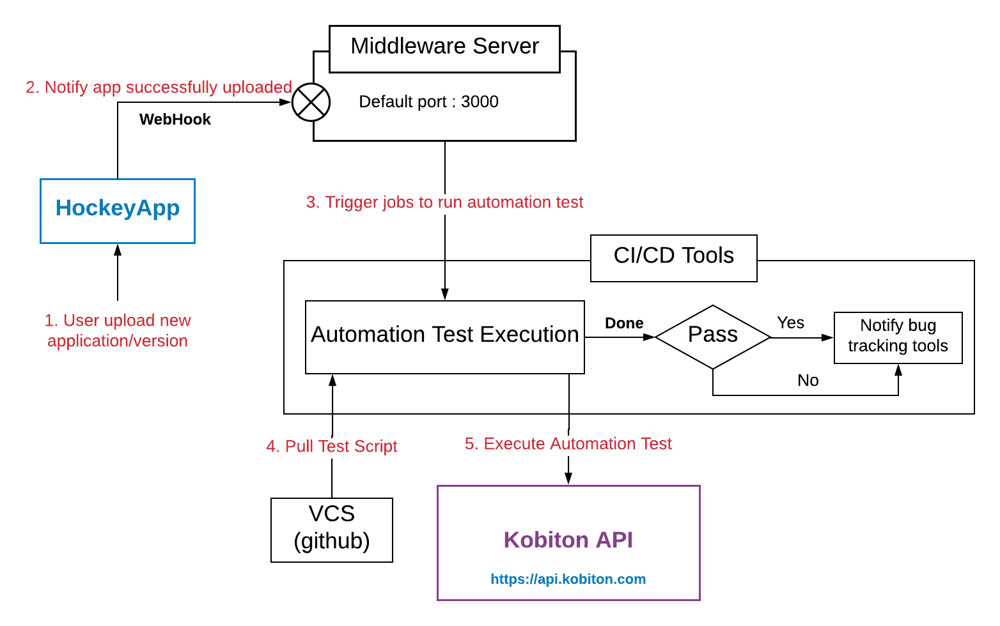

# Integrating Kobiton in TeamCity - HockeyApp - Appium - ReactNative development pipeline

Kobiton is a mobile experienceplatform that accelerates delivery and testing of mobile apps by offering manual and automated testing on real devices, in the cloud or on-premise. This guide will demonstrate how to trigger TeamCity to get the latest build on HockeyApp and run Appium automation tests on Kobiton Test Cloud service.

Below is the diagram demonstrating how Kobiton integrates with your app development pipeline:

This repository has provided instructions and samples of automation test scripts and minimal middleware server. Refer to [our documentation](./Readme/automation.md) for more details.