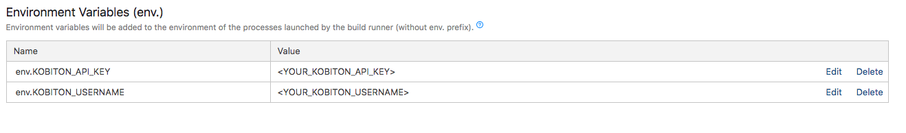

# Running Automation test with Kobiton with TeamCity
## Table of contents
+ [A. Integrating Kobiton with TeamCity](#a-integrating-kobiton-with-teamcity)
  + [1. Preparation](#1-preparation)
    + [1.1 Gettting Kobiton username and API key](#1.1-gettting-kobiton-username-and-api-key)
    + [1.2 Samples](#1.2-samples)
  + [2. Setup](#2-setup)
    + [2.1. Setting environment variable](#2.1-setting-environment-variables)
    + [2.2 Getting desired capabilities](#2.2-getting-desired-capabilities)
    + [2.3 Configuring TeamCity](#2.3-configuring-teamcity)
  + [3. Execution](#3-execution)
+ [B. Integarting Kobiton with TeamCity and HockeyApp](#b-integarting-kobiton-with-teamcity-and-hockeyapp)
  + [1. Preparation](#1-preparation)
  + [2. Setup Middleware Server](#2-setup-middleware-server)
  + [3. Execution](#3-execution)
+ [C. Fetching test session data](#c-fetching-test-session-data)
  + [1. Viewing test session data on Kobiton website](#1-viewing-test-session-data-on-kobiton-website)
  + [2. Fetching test session data through Kobiton REST API](#2-fetching-test-session-data-through-kobiton-rest-api)
+ [D. Feedback](#d-feedback)
## A. Integrating Kobiton with TeamCity
### 1. Preparation
- NodeJS installed: NodeJS is required to run our sample automation test below.
  > Follow the [installation document](https://nodejs.org/en/download/). 
#### 1.1 Gettting Kobiton username and API key
In order to execute test on Kobiton, these two must-have parameters must be provided: Username and API key. They are necessary for authenticating with Kobiton.

> If you don't have a Kobiton account, visit https://portal.kobiton.com/register to create an account.

Follow the instruction at `IV. Configure Test Script for Kobiton` section on [our blog article](https://kobiton.com/blog/tutorial/parallel-testing-selenium-webdriver/) to get Kobiton username and API key.
#### 1.2 samples
In this repository, we have already provided samples for executing automation test with Kobiton through TeamCity:
  -  [automation-test.js](../sample/automation-script/automation-test.js): script written in NodeJS for executing automation test on Kobiton devices.
  -  [server.rb](../sample/server/server.rb): Script for initiating WebHook server.

To use the provided sample, follow these steps:
1. Fork this repository https://github.com/kobiton/TeamCity-HockeyApp-Appium-ReactNative.
2. In your TeamCity project, create `Build configurations` to use the forked repository.
3. Clone the forked repository.
### 2. Setup
#### 2.1 Setting environment variables
In your TeamCity build project settings, add two environment variables:
 
 + KOBITON_API_KEY: Your Kobiton's API key
 + KOBITON_USERNAME: Your Kobiton's username

Your `Environment Variables` should look like:

  
#### 2.2 Getting desired capabilities
In order to interact with a specific device in Kobiton, its corresponding desired capabilities needs to be supplied.

In the provided sample automation test script, we have pre-configured them to execute automation test of the provided application(s) from `KOBITON_SESSION_APPLICATION_URL` environment variable, and execute the tests on one of available devices which name begins with `iPhone` or `Galaxy` if **ONLY** platform name is supplied in desired capabilities (Android/iOS). 

If you want to use default configuration, add an enviroment variable  `KOBITON_DEVICE_PLATFORM_NAME` with value `Android` if you want to execute on Android devices or `iOS` if you on iOS devices.

If you want to use a specific device, follow below steps:

**Getting desired capabilities**

  1. Go to https://portal.kobiton.com and login to your Kobiton account.
  2. Click **Devices** in the top navigation bar.

  
 
  3. Hover over any device you want to test with and click on Automation settings button (the one with gear symbol).
 
  
 
  4. On the left-hand side, you can select your preferred language, App Type, etc.
  - In this example, we use **NodeJS** as the default language of the script. Therefore, choose **NodeJS** in `Language` section.
  - Select **Hybrid/Native from Apps** in `App type` section.

   

**Setting desired capabilities**

Add these environment variables to your project configuration in TeamCity with values of corresponding variables taken from the collected desired capabilities as shown in the table below

| Environment Variables      | Desired Capabilities Variables | Description                                           | Required                    |
|-------------------------------------|--------------------------------|-------------------------------------------------------|-----------------------------|
| KOBITON_DEVICE_PLATFORM_NAME        | platformName                   | Kobiton Device Platform Name (e.g: Android, iOS)      | YES                         |
| KOBITON_DEVICE_NAME          | deviceName                     | Kobiton Device Name                                   | No                          |
| KOBITON_DEVICE_PLATFORM_VERSION | platformVersion            | Kobiton Device platform version   | No                         |
| KOBITON_SESSION_DEVICE_GROUP        | deviceGroup                    | Group that device belongs to                          | No                          |
| KOBITON_PRIVATE_DEVICE_UDID         | udid                           | UDID for executing tests on specific in-house devices | In-House devices only |
| KOBITON_ORGANIZATION_GROUP_ID       | groupId                        | ID of device group that the user is assigned to       | No                          |

> More information about desired capabilities and its parameters/usage". Refer to https://docs.kobiton.com/automation-testing/desired-capabilities-usage/ if you plan to modify this part.
#### 2.3 Configuring TeamCity
 In your project configuration, add a build step with `Command Line` as runner type and custom scripts.

 

 In `exexcute command`, replace `<TEST_SCRIPT>` with `npm run automation-test`if you want to execute the provided automation test script.
### 3. Execution
After doing above steps, push your modified test script(s) to your GitHub repository. TeamCity will install necessary dependencies and then execute the test on Kobiton.


## B. Integarting Kobiton with TeamCity and HockeyApp
### 1. Preparation
-  Ruby 2.x installed
  > If you haven't installed Ruby on your server, please refer to Ruby Installation documentation on how to install Ruby.
### 2. Setup Middleware Server
Kobiton has provided script for setting up a minimal server for receiving WebHook notifications from HockeyApp and triggering TeamCity to execute automation test of that application on Kobiton. The script will load settings from a configuration file and start a WebHook listener. This script must be executed on the server mentioned in [Prerequisites](#1-prerequisites).

In order to use the provided script, please make some modifications to the configuration file:

1. Navigate to `/sample/server/` and open `server.rb` file.

2. Replace with your own values:
+ `teamcity_username`: Your TeamCity username
+ `teamcity_password`:  Your TeamCity password
+ `port`: Web server's port number. Default: 3000
+ `build_id`: TeamCity Build configuration ID
+ `server`: Your host TeamCity
3. Execute the provided script using the below command:
```bash
ruby server.rb
```
4. In application configuration in HockeyApp, change WebHook server address to your corresponding server address, port.
  > Refer to https://www.hockeyapp.net/blog/2013/08/06/hockeyapp-webhooks.html for instructions on how to configure HockeyApp Webhooks.
5. Send a ping request from HockeyApp. If your server console output contains `Ping request received`, then you have successfully configured your server to listen for WebHook from HockeyApp.
### 3. Execution
1. Upload your application to HockeyApp. It will process the uploaded file and send notification to the WebHook server.

2. The WebHook server will extract the direct download link of the application and trigger TeamCity to execute automation test of it on Kobiton.

Your test execution process can be viewed on TeamCity.


+ Go to https://portal.kobiton.con/sessions to check your test session status.


## C. Fetching test session data
### 1. Viewing test session data on Kobiton website
1. Go to https://portal.kobiton.com/sessions, login with your Kobiton account.
2. You will see your executed sessions and their statuses.
### 2. Fetching test session data through Kobiton REST API

Kobiton already provides samples written in NodeJS to get session information, session commands using Kobiton REST API.

Follow the instruction at https://github.com/kobiton/samples/tree/master/kobiton-rest-api.

## D. FEEDBACK 
If you have further information or any issue(s), feel free to contact Kobiton for more support.
1. Go to https://portal.kobiton.com
2. In the navigation bar at the top of the page, click **Support**.


3. Fill in all necessary information and click **Submit**.
  
