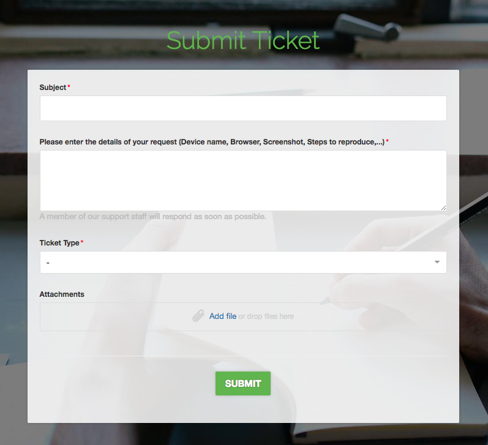

# Running Automation test with Kobiton
## Table of contents
+ [A. Preparation](#a-preparation)
  + [1. Prerequisites](#1-prerequisites)
  + [2. Gettting Kobiton username and API key](#2-gettting-kobiton-username-and-api-key)
  + [3. Samples](#3-samples)
+ [B. Setup](#b-setup)
  + [1. Getting desired capabilities](#1-getting-desired-capabilities)
  + [2. Configuring automation test script](#2-configuring-automation-test-script)
  + [3. Configuring HockeyApp Webhooks listenner](#3-configuring-hockeyapp-webhooks-listenner)
  + [4. Configuring TeamCity project](#4-configuring-teamcity-project)
+ [C. Execution](#c-execution)
  + [1. Runnig automation test on Kobiton devices](#1-running-automation-test-on-kobiton-devices)
  + [2. Fetch test session data through Kobiton REST API](#2-fetch-test-session-data-through-kobiton-rest-api)
+ [D. Feedback](#d-feedback)
## A. PREPARATION
### 1. Prerequisites
+ A server for receiving HockeyApp webhooks
  + Can be virtual, bare-metal or container, etc.
  + MUST be visible to the internet.
  + Has Ruby 2.x installed.
  > If you haven't installed Ruby on your server, please refer to [Ruby Installation documentation](https://www.ruby-lang.org/en/documentation/installation/) on how to install Ruby on corresponding OSes.
+ Install nodejs: Nodejs is required to run our sample automation test below.
  > follow the [installation document](https://nodejs.org/en/download/). 
### 2. Gettting Kobiton username and API key
In order to execute test on Kobiton, these two must-have parameters must be provided: Username and API key. They are necessary for authenticating with Kobiton.

> If you don't have a Kobiton account, visit https://portal.kobiton.com/register to create an account.

Follow the instruction at `IV. Configure Test Script for Kobiton` section on [our blog article](https://kobiton.com/blog/tutorial/parallel-testing-selenium-webdriver/) to get Kobiton username and API key.
### 3. Samples
In this repository, we have already provided samples for executing automation test with Kobiton through TeamCity:
  -  [automation-test.js](../sample/automation-script/automation-test.js): script for execute automation test on Kobiton iOS devices.
  -  [server.rb](../sample/server/server.rb): script for starting WebHook server.
To use the provided sample, follow these steps:
1. Fork [this repository](https://github.com/kobiton/TeamCity-HockeyApp-Appium-ReactNative).
2. In your TeamCity project, create a `Build configurations` to use the forked repository. If you don't know how to do it, please follow [TeamCity document](https://confluence.jetbrains.com/display/TCD18/Build+Configuration+Template) for instructions.
3. Clone the forked repository to configure in the next steps.
## B. SETUP
### 1. Getting desired capabilities
Desired capabilities need to be added to the automation test script to allow the test to be executed on Kobiton device. The desiredCap are just matching only for one device. If you want to test on other devices, please make sure noted the different and customize as your need. 

In the provided sample automation test scripts, we have pre-configured them to execute the provided sample application(s) on one of the available device(s) that has the name `Galaxy` for `Android` and `iPhone` for iOS. If you want to use other specific device(s), follow the instruction below to get the corresponding desired capabilities for that device(s).

**How to get desired capabilities**

In this tutorial, we will be showing how to get desired capabilities for executing automation test on `Pixel 2 XL 8.1.0`.
  1. Go to https://portal.kobiton.com and login to your Kobiton account.
  2. Click **Devices** in the top navigation bar.

  
 
  3. Hover over any device you want to test with and click on Automation settings button (the one with gear symbol).
 
  
 
  4. On the left-hand side, you can select your preferred language, App Type, etc.
  - In this example, we use **NodeJS** as the default language of the script. Therefore, choose **NodeJS** in `Language` section.
  - Select **Hybrid/Native from Apps** in `App type` section. 

 Kobiton automatically generates your desired capabilities into code based on the selected options. Note values of `deviceName`, `platformversion` and `platformName` to prepare next steps.

   
### 2. Configuring automation test script
In the `automation-script` folder, we have provided a sample scripts for executing automation test on Kobiton devices.
 As mentioned above, the desired capabilities in provided automation test scripts have already been pre-configured. If you have chosen custom desired capabilities, please follow steps below to apply the collected desired capabilities.
 1. Open `android-app-test.js` if you want to execute test on Android or open `ios-app-test.js` if you want to execute test on iOS devices.
 2. Replace `desiredCaps` in the script with one collected in the previous step.
 Example of desired capabilities for executing `ApiDemos-debug` application on `Pixel 2 XL` running `Android 8.1.0`:
```javascript
var desiredCaps = {
  sessionName:        'Automation test session',
  sessionDescription: 'This is an example for Android app', 
  deviceOrientation:  'portrait',  
  captureScreenshots: true, 
  app:                '<APP_URL>', 
  deviceGroup:        'KOBITON', 
  deviceName:         '<KOBITON_DEVICE_NAME>',
  platformVersion:    '<KOBITON_DEVICE_VERSION>',
  platformName:       'Android' 
}
```
> More information about automation testing with Kobiton can be found at https://docs.kobiton.com/automation-testing/automation-testing-with-kobiton/.
### 3. Configuring HockeyApp Webhooks listenner
Kobiton has provided script for setting up a small, basic server for receiving WebHook notifications from HockeyApp and triggering TeamCity to execute automation test of that application on Kobiton. The script will load settings from a configuration file and start a WebHook listener. This script must be executed on the server mentioned in [Prerequisites](#1-prerequisites).

In order to use the provided script, please make some modifications to the configuration file:

1. Navigate to `/sample/server/` and open `server.rb` file.

2. Replace with your own values:
+ `teamcity_username`: Your TeamCity username you use to login to TeamCity 
+ `teamcity_password`:  Your TeamCity password you use to login to TeamCity
+ `port`: Web server's port number. Default: 3000
+ `build_id`: Build configuration ID
3. Execute the provided script using the below command:
```bash
ruby webhook_server.rb
```
4. In your application configuration in HockeyApp, create Webhooks from server address to your corresponding server address, port.
>  Follow [HockeyApp Webhooks](https://www.hockeyapp.net/blog/2013/08/06/hockeyapp-webhooks.html) to instruction to create one. 
5. Send a ping request from HockeyApp. If your server console output contains Ping request received, then you have successfully configured your server to listen for WebHook from HockeyApp.
### 4. Configuring TeamCity project
**Attaching environment variables to TeamCity**

 Add your Kobiton username and API key as environment variables.

  

 **Setup TeamCity automation test**

 In your project configuration, add a build step with `Command Line` as runner type and custom scripts.

 

 Replace the variable `<TEST_SCRIPT>` in execute command as:

- `npm run automation-test`: if you want to execute automation test on Android.
## C. EXECUTION

### 1. Running automation test on Kobiton devices
+ After doing above steps, push your modified test script(s) to your GitHub repository. TeamCity will install necessary dependencies and then execute the test on Kobiton.

After you have pushed, the build process on TeamCity will end with error. That is normal, just simply ignore it.

To execute the provided automation test script(s), simply upload your application package to HockeyApp. HockeyApp will process the uploaded file, send notification to the WebHook server, the server will then execute the automation test script on TeamCity with the URL received from HockeyApp WebHook notification.

Your test execution process can be viewed on TeamCity.


+ Go to https://portal.kobiton.con/sessions to check your test session status.


### 2. Fetch test session data through Kobiton REST API

Kobiton already provides samples written in NodeJS to get session information, session commands using Kobiton REST API.

Follow the instruction at https://github.com/kobiton/samples/tree/master/kobiton-rest-api.

## D. FEEDBACK 
If you have further information or any issue(s), feel free to contact Kobiton for more support.
1. Go to https://portal.kobiton.com
2. In the navigation bar at the top of the page, click **Support**.


3. Fill in the information for your request and click **Submit**.
  
