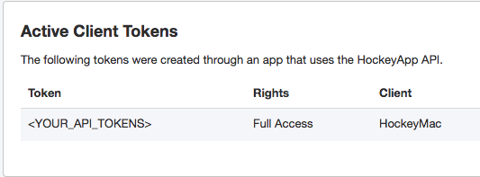
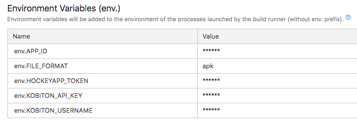
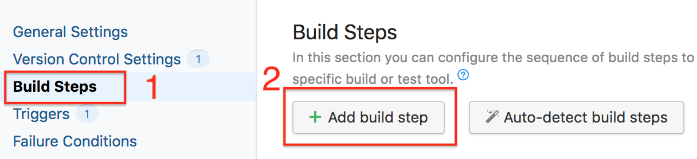
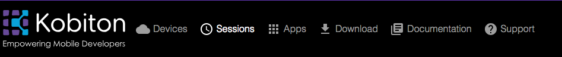
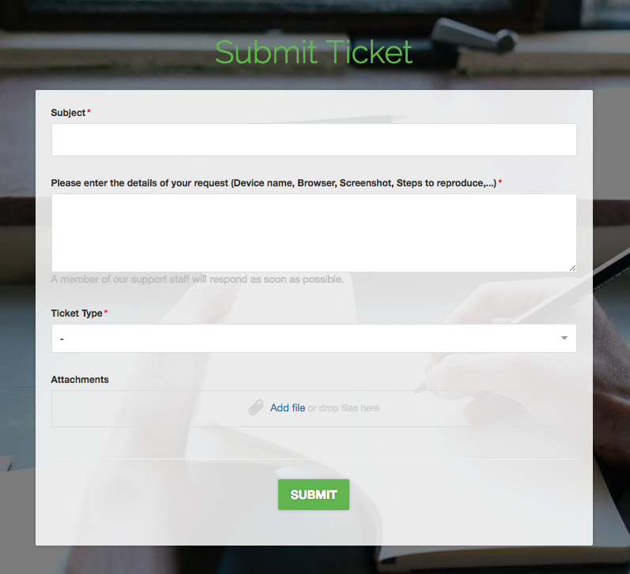

# Running Automation test with Kobiton
## Table of contents
+ [Prerequisites](#prerequisites)
+ [1. Configure TeamCity and integrate with GitHub](#1-configure-teamcity-and-integrate-with-github)
+ [2. Getting required parameters](#2-getting-required-parameters)
+ [3. Configure automation test script](#3-configure-automation-test-script)
+ [4. Run automation test on Kobiton devices](#4-run-automation-test-on-kobiton-devices)
+ [5. Fetch test session data through Kobiton REST API](#5-fetch-test-session-data-through-kobiton-rest-api)
+ [6. Feedback](#6-feedback)
## Prerequisites 
- Java(JRE) for running TeamCity server. Supported versions:
  + Oracle Java 8 and updates. 32 or 64 bit (64 bit is recommended for production)
  + OpenJDK 8. 32 or 64 bit
  > Go to [this link](http://www.oracle.com/technetwork/java/javase/downloads/jre8-downloads-2133155.html) to download Java.
- Kobiton account
  >Please visit https://portal.kobiton.com/register to create new account.
- HockeyApp account
  >Go to https://rink.hockeyapp.net/users/sign_up to create a new account.
- Node
  >You can go to https://nodejs.org/en/download/ to download the latest version of node.
- The project for developing mobile app.
## 1. Configure TeamCity and integrate with GitHub
This part will guide you to how to configure TeamCity to integrate with your automation test GitHub repository. Skip this step if you have already had TeamCity setup.
 + For instruction on how to install and configure TeamCity server, follow [this guide](https://confluence.jetbrains.com/display/TCD18/Installing+and+Configuring+the+TeamCity+Server).

Set up your project and link your app repository that we will test with Kobiton later.
+ You need to configure a connection to your GitHub repository. Instruction on how to connect GitHub with TeamCity can be found [this guide](https://confluence.jetbrains.com/display/TCD10/Integrating+TeamCity+with+VCS+Hosting+Services), in `Connecting to GitHub` section. After the connection is configured, TeamCity will be granted with `full control` of private repositories and `Write repository hooks` permission.
 
>More information about TeamCity can be found in [this documentation](https://confluence.jetbrains.com/display/TCD10/TeamCity+Documentation).
## 2. Getting required parameters
We need to get the download URL of your app so that Kobiton can install and run it.

To get app URL, these two must-have parameters are required : HockeyApp APP ID and API Tokens.

To run automation test on Kobiton devices, these three must-have parameters are required: your Kobiton username, Kobiton API key and the desired capabilities. 
### 2.1 Get HockeyApp API Tokens and App ID
Go to https://rink.hockeyapp.net/manage/dashboard with your HockeyApp account to get App ID and API Tokens to prepare for the next step.
- **Get App ID**

  Click your app, you can see App ID 

  
- **Get API Tokens**

  In the top right corner, click **user icon** -> **My Devices** -> **API Tokens**.

  Create a Hockey App API token for your app with `Full Access` or `Upload and Release` right.

  

### 2.2 Get Kobiton Username and APi key
Go to https://portal.kobiton.com and login to your Kobiton account.
- **Username**
  + Click *user icon* -> **"Profile"** (you might find it in the top right corner)

  

- **API key** 
  + Click *user icon* -> **"Settings"**

  
### 2.3 Get desired capabilities
The desired capabilities need to be added to the automation test script to allow the test to be executed on Kobiton device.
  + Go to https://portal.kobiton.com, click **Devices** in the top navigation bar.
 
    
 
  + Hover over any device you want to test with and click on the Automation settings button (the gear symbol).
 
    
  
  + On the left-hand side, you can select your preferred language, App Type, etc.
  In this example, we use **NodeJS** as the default language of the script. Therefore, choose **NodeJS** in `Language` section and **Hybrid/Native from Apps** in `App type` section. On the right-hand side, Kobiton automatically generates your desired capabilities into code based on the options you selected. Copy the code to prepare for the next step.

   
## 3. Configure automation test script
### 3.1. Fetching the app download URL
To get the app download URL, we have provided a script written in NodeJS. After executing that script, you will get the latest app version, which will be used in the next step.

Downloads the scipt from [this link](./getAppUrl.js) and copy to your automation test folder.
### 3.2 Configure automation test script
Kobiton has already provided sample scripts for automation testing, visit [here](https://github.com/kobiton/samples) for reference. 
> Note: In this guideline, we will use the NodeJS sample (samples/javascript folder) as an example.

Open automation test script file in your repository or create a new one.

Replace `desiredCaps` in the script with the ones collected in the previous step. Then,replace value of `app` element in `desiredCaps` with the `APP_URL` environment variable, which is the download URL of your app. If your automation test script is in other languages, please use the proper method to access this environment variable.

Example in Node.js:

```javascript
var desiredCaps = {
  sessionName:        'Automation test session',
  sessionDescription: '', 
  deviceOrientation:  'portrait',  
  captureScreenshots: true, 
  app:                process.env.APP_URL, 
  deviceGroup:        'KOBITON', 
  deviceName:         '<DEVICE_NAME>',
  platformVersion:    '<DEVICE_VERSION>',
  platformName:       '<DEVICE_PLATFORM_NAME>' 
}
```
### 3.3 Configure TeamCity project
**Attaching environment variable to Teamcity**
+ In your project in TeamCity, on the left side of the page, click **Parameters**. Then click **Add new parameter** button. 


+ Add environment variables. For the **Kind** category, please choose **Environment variable (env.)**. 


Here are the variables we need. For the sake of this guideline, please set the name for these variables like below.

FILE_FORMAT: Your app file extension. `apk` for Android, `ipa` for iOS.

APP_ID: Your app ID

HOCKEYAPP_TOKEN: Hockey App API token

KOBITON_API_KEY: Your Kobiton API Key

KOBITON_USERNAME: Your Kobiton username



**Setup TeamCity automation testing**
After the deployment process, we will test it with Kobiton. When the deploying stage is sucessary completed, TeamCity will execute testing stage. You can config for the deploying stage with steps same bellow.

1. In your TeamCity project, on the left side of the page, click **Build Steps** -> **Add build step** to set build steps.



2. On the right side of the page, for the **Runner type** category, choose **Command Line**.
3. Add below commands in **Custom script** section.

```
  url=$(node getAppUrl)
  APP_URL=$url <YOUR_AUTOMATION_SCRIPT_EXECUTION_COMMAND>
```
>Note: url=$(node getAppUrl): this command is required to get the app download URL and set value of url. **getAppUrl** is the path to node application.
>
> APP_URL=$url: this is required to set value of APP_URL environment variable.

Because we use `android-app-test` written in NodeJS as our automation test script. Therefore, the execution command should be like:


## 4. Run automation test on Kobiton devices
+ Push your changes to GitHub. TeamCity will automatically install necessary dependencies and then run the test on Kobiton. Click the last build, choose **Build Log**, you can see a build log is an enhanced console output of a build.


+ Go to https://portal.kobiton.con/sessions to check your testing session status.


## 5. Fetch test session data through Kobiton REST API

+ Kobiton already provides Node.js samples on how to get session information, session commands using Kobiton REST API. 
+ Go to https://github.com/kobiton/samples/rest-api and follow the instructions.
## 6. Feedback
If you have any issue, you can contact Kobiton for more support.
- Go to https://portal.kobiton.com
- In the navigation bar at the top of the page, click on **Support**.



- Fill in the information for your request and submit your ticket. 
  
