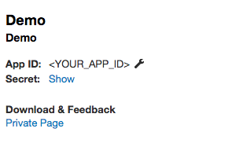
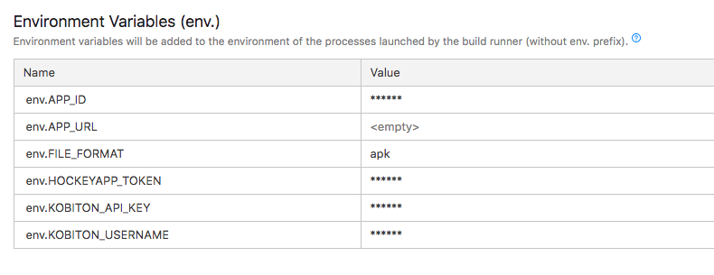

# Running Automation test with Kobiton
## Table of contents
+ [Prerequisites](#prerequisites)
+ [1. Configure TeamCity and integrate with GitHub](#1-configure-teamcity-and-integrate-with-github)
+ [2. Configure HockeyApp](#2-configure-hockeyapp)
+ [3. Configure automation test script](#3-configure-automation-test-script)
+ [4. Run automation test on Kobiton devices](#4-run-automation-test-on-kobiton-devices)
+ [5. Fetch test session data through Kobiton REST API](#5-fetch-test-session-data-through-kobiton-rest-api)
+ [6. Feedback](#6-feedback)
## Prerequisites 
- Java(JRE). Supported are:
  + Oracle java 8 or higher
  + OpenJDK 8
- Kobiton account
  >Please visit https://portal.kobiton.com/register to create new account.
- HockeyApp account
  > Please visit https://hockeyapp.net/ to create new account.
- Node: 6.0.0. or higher
## 1. Configure TeamCity and integrate with GitHub
Firstly, let's assume you already have an empty GitHub repository for running automation test.

This part will guide you to how to configure TeamCity to integrate with your automation test GitHub repository. Skip this step if you have already had TeamCity setup.
 + For instruction on how to install and configure TeamCity server, follow [this guide](https://confluence.jetbrains.com/display/TCD18/Installing+and+Configuring+the+TeamCity+Server).

Set up your project and link your app repository that we will test with Kobiton later.
+ You need to configure a connection to your GitHub repository. Instruction on how to connect GitHub with TeamCity can be found [this guide](https://confluence.jetbrains.com/display/TCD10/Integrating+TeamCity+with+VCS+Hosting+Services), in `Connecting to GitHub` section. After the connection is configured, TeamCity will be granted with `full control` of private repositories and `Write repository hooks` permission.
 
>More information about TeamCity can be found in [this documentation](https://confluence.jetbrains.com/display/TCD10/TeamCity+Documentation).
## 2. Configure HockeyApp 
HockeyApp is a service that allows developers to recruit and manage testers, distribute apps, and collect crash reports, among other things.

We need to get the download URL of your app so that Kobiton can install and run it.
### 2.1 Get HockeyApp API Tokens and App ID
To get app URL, these two must-have parameters are required : HockeyApp APP ID and API Tokens.

Go to https://rink.hockeyapp.net/manage/dashboard to get App ID and API Tokens to prepare for the next step.
- **Get App ID**

  Click your app, you can see App ID 

  
- **Get API Tokens**

  In the top right corner, click **user icon** -> **My Devices** -> **API Tokens**.

  Create a Hockey App API token for your app with `Full Access` or `Upload and Release` right.

  
### 2.2. Fetching the app download URL

To get the app download URL, we have provided a script written in NodeJS. After executing that script, you will get download URL of that app, which will be used in the next step.

Downloads the scipt from [this link]('./getAppUrl.js') and copy to your automation test folder.

## 3. Configure automation test script
### 3.1 Get Username and API key
Go to https://portal.kobiton.com and login to your Kobiton account.
- Username
  + Click *user icon* -> **"Profile"** (you might find it in the top right corner)

  

- API key 
  + Click *user icon* -> **"Settings"**

  

### 3.2 Get desired capabilities
The desired capabilities need to be added to the automation test script to allow the test to be executed on Kobiton device.
  + Click **Devices** in the top navigation bar.
 
    
 
  + Hover over any device you want to test with and click on the Automation settings button (the gear symbol).
 
    
 
  + Kobiton automatically translates your desired capabilities into code based on the options you selected. Simply copy and paste this code into your test script under the Input Capabilities section. This will replace the current configuration with the Kobiton device configuration and change the parameters in your test script. 
  
  + On the left-hand side, you can select your preferred language, App Type, etc.
  In this example, we use **NodeJS** as the default language of the script. Therefore, choose **NodeJS** in `Language` section and **Hybrid/Native from Apps** in `App type` section.

   

### 3.3 Configure automation test script
Kobiton has already provided sample scripts for automation testing, visit [here](https://github.com/kobiton/samples) for reference. 
> Note: In this guideline, we will use the Node.js sample (samples/javascript folder) as an example.

Use Kobiton’s desired capabilities settings to configure your test scripts. Our settings include all the required configurations you need to automate your test using the Appium Framework and to run your automation test on real devices in the Kobiton cloud.

Open automation test script file in your repository or create a new one.

Add an environment variable named `APP_URL`, replace `desiredCaps` in the script with the ones collected in the previous step. Then, replace `app` value of `desiredCaps` with the `app_url` variable.

Example:

```javascript
const username = process.env.KOBITON_USERNAME 
const apiKey = process.env.KOBITON_API_KEY 
const app_url = process.env.APP_URL 

const kobitonServerConfig = {
  protocol: 'https',
  host: 'api-test.kobiton.com',
  auth: `${username}:${apiKey}`
}
var desiredCaps = {
  sessionName:        'Automation test session',
  sessionDescription: '', 
  deviceOrientation:  'portrait',  
  captureScreenshots: true, 
  app:                app_url, 
  deviceGroup:        'KOBITON', 
  deviceName:         '<DEVICE_NAME>',
  platformVersion:    '<DEVICE_VERSION>',
  platformName:       '<DEVICE_PLATFORM_NAME>' 
}
```
### 3.4 Configure TeamCity project
**Attaching environment variable to Teamcity**
+ In your project in TeamCity, on the left side of the page, click **Parameters**. Then click **Add new parameter** button. 


+ Add environment variables. For the **Kind** category, please choose **Environment variable (env.)**. 


>Note: Here are the variables we need. For the sake of this guideline, please set the name for these variables like below.
> 
>APP_URL: You need put empty value of this variable 
> 
>FILE_FORMAT: Your app file extension. `apk` for Android, `ipa` for iOS.
>
>APP_ID: Your app ID
>
>HOCKEYAPP_TOKEN: Hockey App API token
>
>KOBITON_API_KEY: Your Kobiton API Key
>
>KOBITON_USERNAME: Your Kobiton username



**Follow steps below to setup TeamCity for automation testing.**

>Note: In this example, we will be running Android App Testing. Therefore, we will use `android-app-test` script.

1. In your TeamCity project, on the left side of the page, click **Build Steps** -> **Add build step** to set build steps.


2. On the right side of the page, for the **Runner type** category, choose **Command Line**.
3. Add below commands in **Custom script** section.

```
  APP_URL=$(node hockeyAppApi)
  npm install
  npm run android-app-test
```


>Note: APP_URL=$(node hockeyAppApi): this command is required to set value of `APP_URL`.
## 4. Run automation test on Kobiton devices
+ Push your changes to GitHub. TeamCity will automatically install necessary dependencies and then run the test on Kobiton. Click the last build, choose **Build Log**, you can see a build log is an enhanced console output of a build.


+ Go to https://portal.kobiton.con/sessions to check your testing session status.


## 5. Fetch test session data through Kobiton REST API

+ Kobiton already provides Node.js samples on how to get session information, session commands using Kobiton REST API. 
+ Go to https://github.com/kobiton/samples/rest-api and follow the instructions.
## 6. Feedback
If you have any issue, you can contact Kobiton for more support.
- Go to https://portal.kobiton.com
- In the navigation bar at the top of the page, click on **Support**.


- Fill in the information for your request and submit your ticket. 
  
